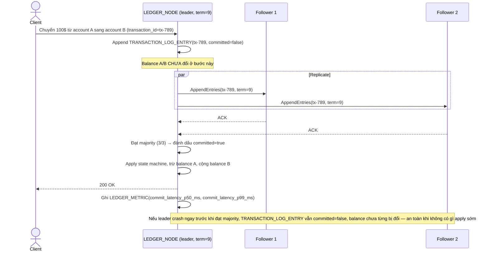

# Enhance sequence — Apply giao dịch chỉ sau khi log entry commit

Đây là **enhance** của flow đã có ở base (`2-base-apply-transaction-sqd.md`). So với base (apply ngay khi nhận), nay giao dịch trước tiên là 1 `TRANSACTION_LOG_ENTRY`, chỉ được `committed=true` sau khi replicate tới majority node, và balance account chỉ cập nhật (apply state machine) sau bước commit này, không apply sớm — đáp ứng đúng yêu cầu 1 của đề bài, đồng thời ghi nhận metric commit latency.

