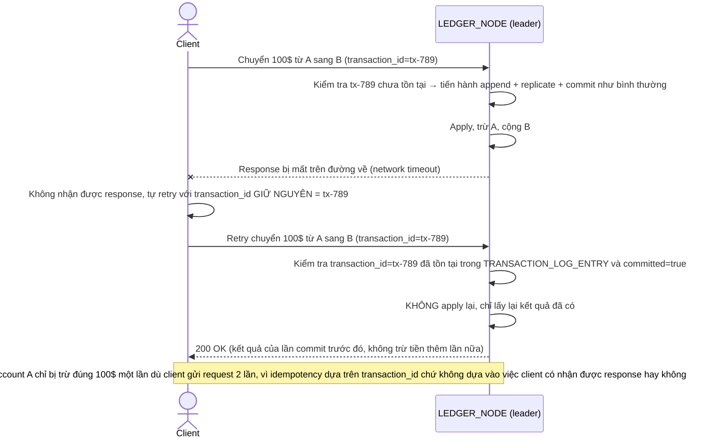

# Enhance sequence — Retry sau timeout không double-apply (idempotency)

Đây là **enhance** của flow đã có ở base (`3-base-retry-after-timeout-sqd.md`). So với base (apply lại vô điều kiện gây double-apply), nay mỗi giao dịch mang `transaction_id` duy nhất do client sinh ra — trước khi apply, leader kiểm tra `transaction_id` đã tồn tại trong `TRANSACTION_LOG_ENTRY` chưa, nếu có rồi thì trả lại đúng kết quả cũ thay vì apply lần 2 — đáp ứng đúng yêu cầu 4 của đề bài.

