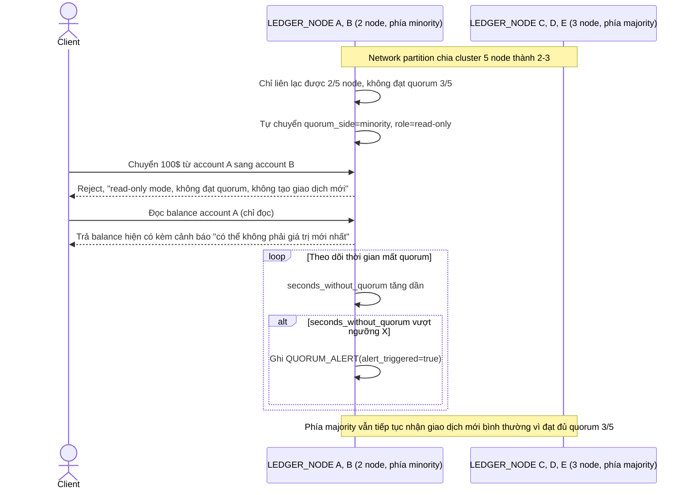

# Enhance sequence — Phía minority chuyển read-only khi network partition

Đây là **enhance**, flow hoàn toàn mới phát sinh từ enhance — chưa tồn tại ở base vì base chỉ có 1 node, không có khái niệm minority/majority. Khi network partition chia cluster, phía không đạt quorum phải tự chuyển sang read-only/reject-write, không tự tạo giao dịch mới, để tránh double-ledger khi partition được hàn lại — đáp ứng đúng yêu cầu 2 của đề bài, kèm cảnh báo khi mất quorum quá lâu.

