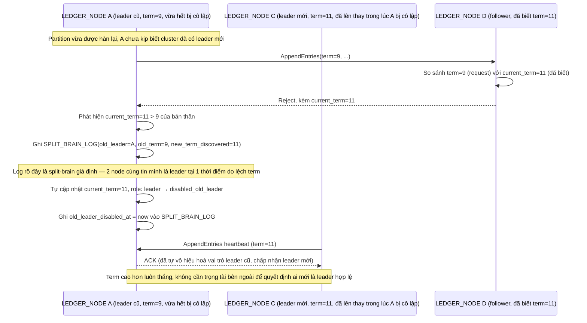

# Enhance sequence — Phát hiện split-brain giả định và tự vô hiệu hoá leader cũ

Đây là **enhance**, flow hoàn toàn mới phát sinh từ enhance — chưa tồn tại ở base vì base không có nhiều node nên không thể có 2 leader cùng lúc. Khi partition hàn lại và 1 node vẫn tưởng mình là leader với term cũ trong khi cluster đã có leader mới với term cao hơn, hệ thống phải phát hiện, log rõ đây là split-brain giả định, và tự động vô hiệu hoá leader cũ ngay khi nó biết term mới — đáp ứng đúng yêu cầu 3 của đề bài.

