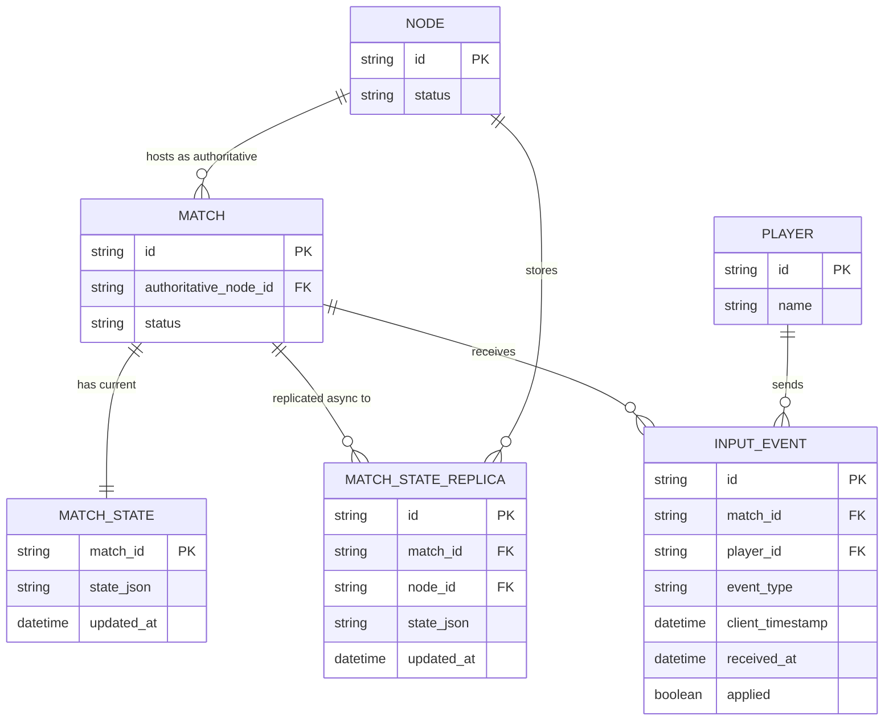

# Base ERD — Cụm game server trước khi có consensus

Đây là **base**: mô hình dữ liệu suy luận từ ngữ cảnh đề bài, thể hiện trạng thái **trước khi** cụm có cơ chế đồng thuận (consensus). Base đã có sẵn cụm nhiều node, mỗi trận đấu được gán cho đúng 1 node giữ vai trò "authoritative" (nguồn sự thật cho trạng thái trận), các node còn lại chỉ nhận bản sao trạng thái theo kiểu replicate bất đồng bộ (async, không có log thứ tự, không có xác nhận majority). Input người chơi được xếp thứ tự dựa trên `client_timestamp` do client tự gửi kèm — đây chính là điểm yếu mà enhance phải sửa. Chưa có khái niệm log đồng thuận, term, leader election hay xử lý partition.

