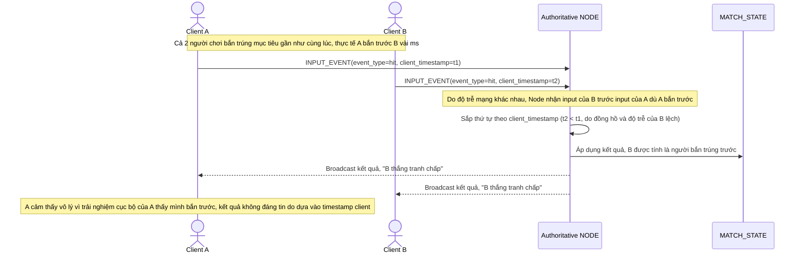

# Base sequence — Resolve contested event (dựa vào client_timestamp)

Đây là **base**, flow xử lý 2 sự kiện tranh chấp gần như đồng thời (2 người chơi cùng bắn trúng 1 mục tiêu). Ở base, node authoritative sắp thứ tự dựa trên `client_timestamp` do từng client tự gửi kèm — đây chính là vấn đề mà yêu cầu 1 của đề bài chỉ ra (client có độ trễ mạng khác nhau nên timestamp không đáng tin), làm nền để so sánh với cách giải quyết bằng log replicate qua majority ở enhance.

