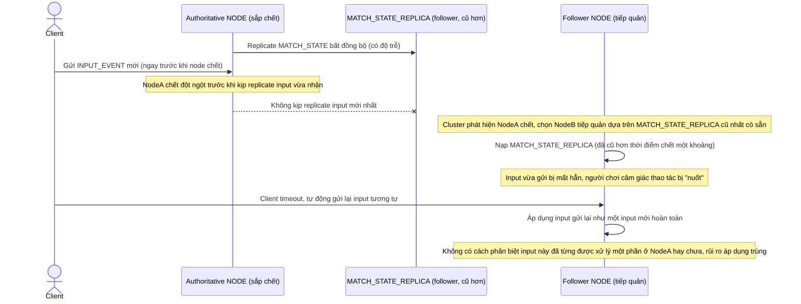

# Base sequence — Node failover (async replicate, không có log)

Đây là **base**, flow khi node authoritative của 1 trận đấu chết đột ngột. Do base chỉ replicate trạng thái bất đồng bộ (không có log sự kiện có thứ tự, không xác nhận majority trước khi commit), việc failover dễ làm mất input chưa kịp replicate hoặc áp dụng lại (double apply) input mà client gửi lại do timeout — đây là vấn đề mà yêu cầu 3 của đề bài yêu cầu enhance phải xử lý rõ ràng.

