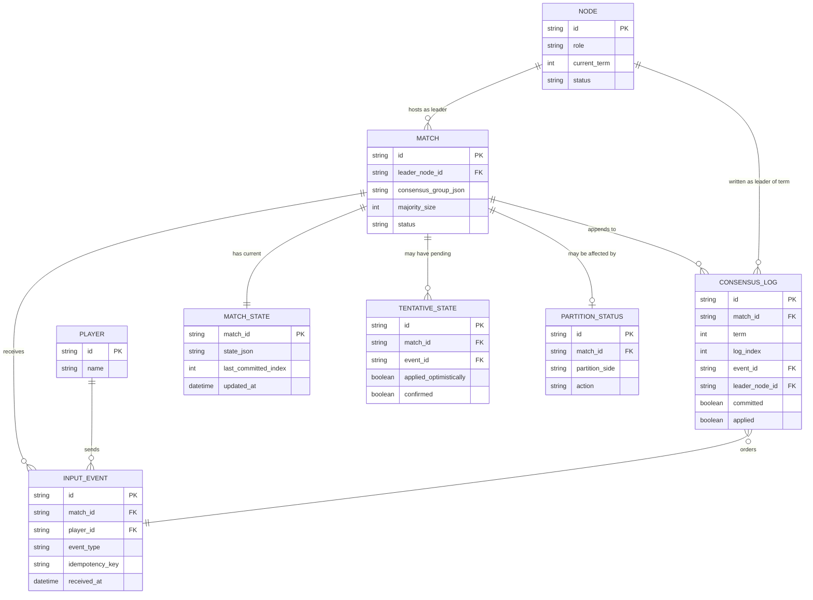

# Enhance ERD — Cụm game server có consensus (log + majority)

Đây là **enhance**: mô hình dữ liệu sau khi thêm cơ chế đồng thuận. So với base, các entity mới: `CONSENSUS_LOG` (log sự kiện có `term`/`index`, được replicate và commit theo majority, thay cho việc replicate async không thứ tự), `NODE` được bổ sung `role` (leader/follower/candidate) và `current_term` để phục vụ leader election, `MATCH` được bổ sung `consensus_group` (danh sách node tham gia đồng thuận cho trận đó) và `majority_size`, `TENTATIVE_STATE` ghi nhận trạng thái áp dụng lạc quan chưa được xác nhận (phục vụ trade-off chờ majority và rollback), và `PARTITION_STATUS` ghi nhận trận nào đang ở phía minority cần migrate hoặc pause. `INPUT_EVENT` được bổ sung `idempotency_key` để chống double-apply khi client gửi lại input lúc failover.

