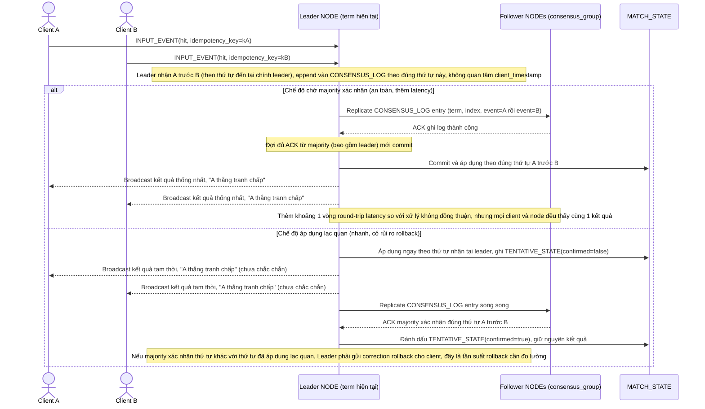

# Enhance sequence — Resolve contested event (log replicate qua majority)

Đây là **enhance**, cùng flow "resolve-contested-event" đã có ở base nhưng nay thay đổi hoàn toàn: thứ tự tranh chấp được xác định bằng thứ tự append vào `CONSENSUS_LOG` tại leader (không dùng `client_timestamp`), và log phải được replicate, xác nhận bởi majority mới commit. Đáp ứng yêu cầu 1 (thứ tự duy nhất dựa trên log replicate qua majority) và yêu cầu 2 (trade-off latency giữa chờ majority và áp dụng lạc quan) của đề bài.

