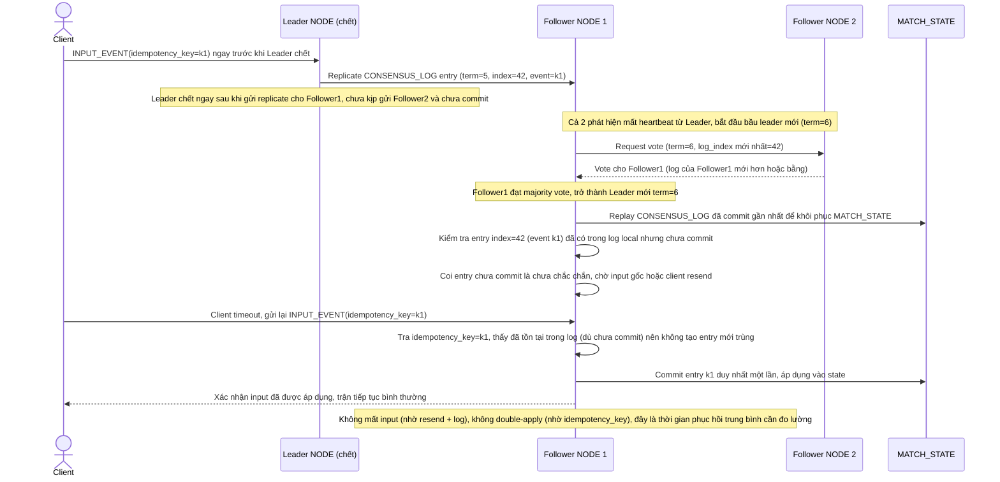

# Enhance sequence — Node failover (leader election + replay log, chống double-apply)

Đây là **enhance**, cùng flow "node-failover" đã có ở base nhưng nay thay đổi: thay vì tiếp quản dựa trên bản snapshot replicate async đã cũ, node mới được bầu qua leader election và phục hồi bằng cách replay `CONSENSUS_LOG` đã commit, đồng thời dùng `idempotency_key` để tránh mất hoặc áp dụng trùng input trong khoảng gap chuyển giao. Đáp ứng yêu cầu 3 của đề bài.

