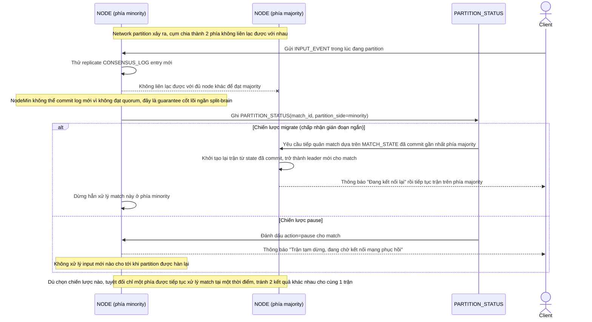

# Enhance sequence — Network partition handling (migrate hoặc pause, không split-brain)

Đây là **enhance**, flow hoàn toàn mới, phát sinh từ enhance — chưa tồn tại ở base vì base không xử lý network partition. Đáp ứng yêu cầu 4 của đề bài: khi cụm bị chia 2 phía, các trận đang chạy ở phía minority phải được migrate sang majority hoặc tạm dừng, tuyệt đối không để 2 phía cùng xử lý độc lập.

