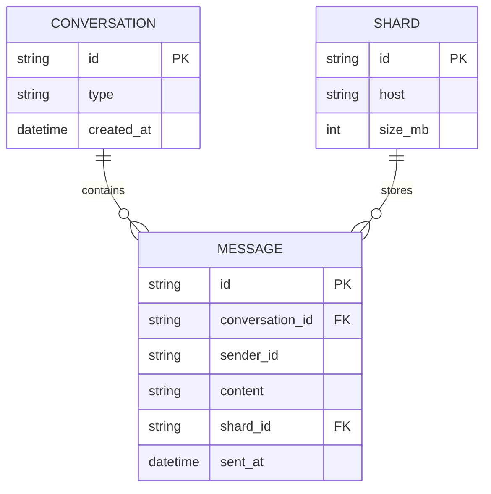

# Base ERD — App chat trước khi sharding theo conversation_id

Đây là **base**: mô hình dữ liệu suy luận từ ngữ cảnh đề bài, thể hiện trạng thái **trước khi** áp dụng consistent hashing theo `conversation_id`. Base đã có nhiều shard DB (đúng như đề bài mô tả "cần chia dữ liệu ra nhiều shard"), nhưng việc chọn shard cho mỗi tin nhắn hiện làm theo cách đơn giản — hash/round-robin theo `message_id` — nên tin nhắn của cùng 1 conversation có thể nằm rải rác trên nhiều shard khác nhau. Chưa có khái niệm hash ring theo conversation, chưa có xử lý hot conversation, chưa có cơ chế migrate khi thêm shard.

