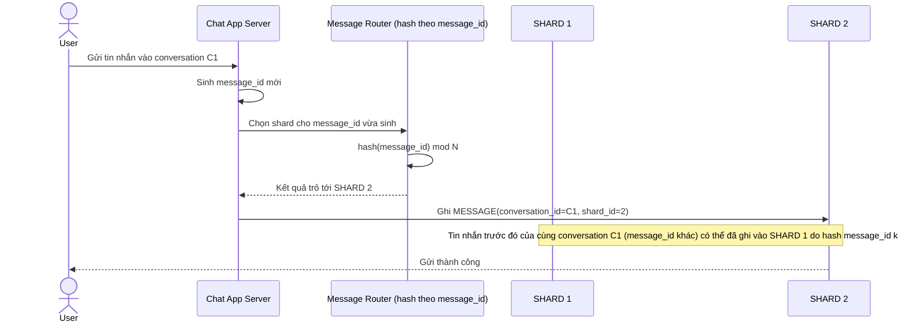

# Base sequence — Send message (route theo message_id, không theo conversation)

Đây là **base**, flow gửi tin nhắn ở trạng thái hiện tại — shard được chọn bằng cách hash/round-robin theo `message_id` (mỗi tin nhắn mới có thể rơi vào 1 shard bất kỳ). Đây là nguyên nhân khiến tin nhắn của cùng 1 conversation bị rải trên nhiều shard, làm nền cho yêu cầu 1 của đề bài (phải luôn về đúng 1 shard theo conversation_id).

