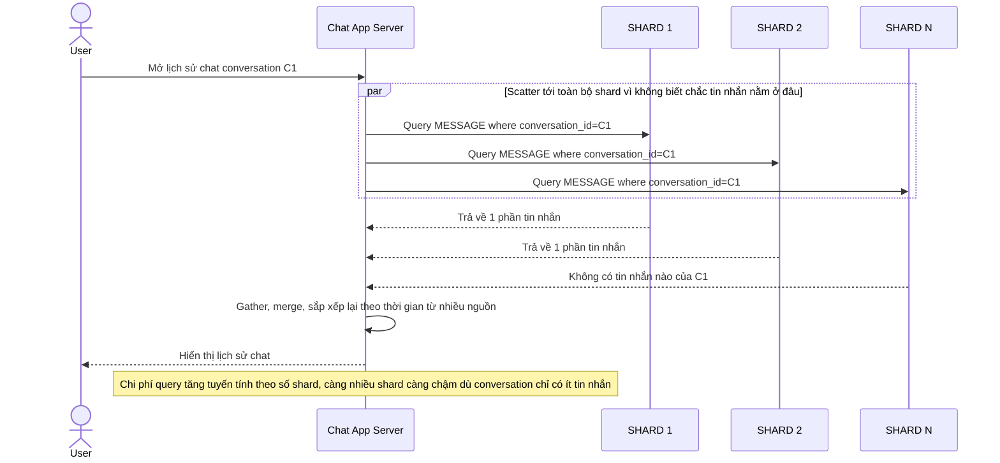

# Base sequence — Load history (scatter-gather nhiều shard)

Đây là **base**, flow tải lịch sử tin nhắn của 1 conversation. Vì tin nhắn của conversation đó có thể rải trên nhiều shard (do route theo message_id ở flow "send-message"), app phải scatter-gather — truy vấn tất cả shard rồi gộp lại — tốn kém và chậm. Đây chính là vấn đề mà yêu cầu 1 của đề bài muốn loại bỏ.

