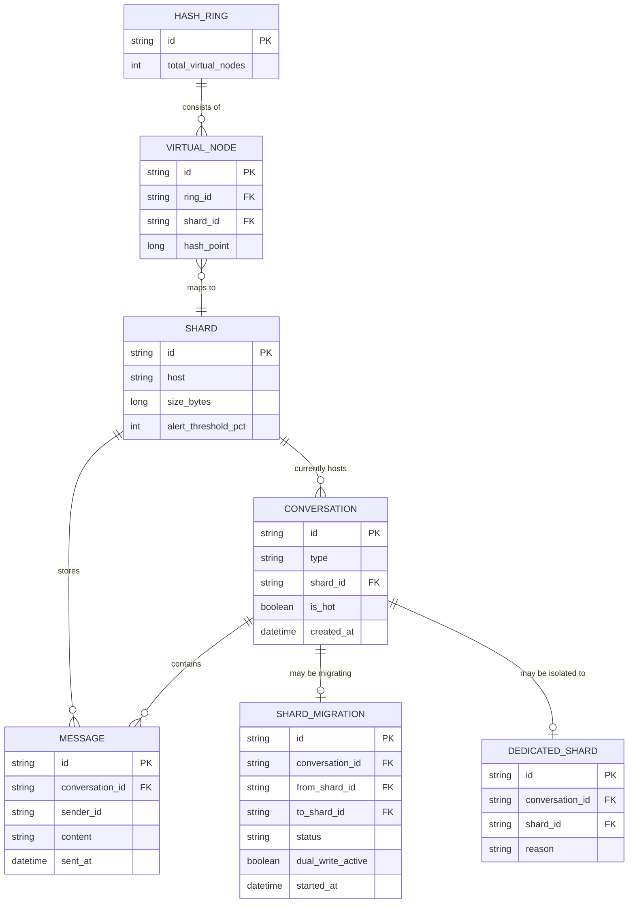

# Enhance ERD — Sharding theo conversation_id với consistent hashing

Đây là **enhance**: mô hình dữ liệu sau khi áp dụng consistent hashing theo `conversation_id`. So với base, các thay đổi/entity mới: `CONVERSATION` được gán `shard_id` cố định (xác định bởi hash ring, không đổi trừ khi bị migrate) và cờ `is_hot` cho conversation vượt ngưỡng kích thước (yêu cầu 2); `HASH_RING`/`VIRTUAL_NODE` ánh xạ điểm hash sang shard vật lý (yêu cầu 1, 3); `DEDICATED_SHARD` dành riêng cho hot conversation (yêu cầu 2); `SHARD_MIGRATION` theo dõi tiến trình di chuyển 1 conversation từ shard cũ sang shard mới, gồm cờ `dual_write_active` để không mất tin nhắn gửi trong lúc migrate (yêu cầu 3, 4); `SHARD` bổ sung `size_bytes` và `alert_threshold_pct` phục vụ cảnh báo dung lượng (yêu cầu 5). `MESSAGE` không còn tự chọn shard theo message_id nữa mà luôn ghi vào đúng shard của conversation.

