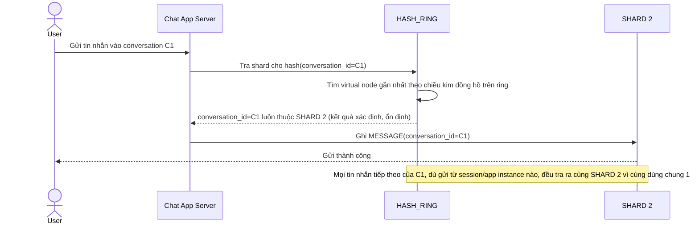

# Enhance sequence — Send message (route theo consistent hash của conversation_id)

Đây là **enhance**, cùng flow "send-message" đã có ở base nhưng nay thay đổi: shard được xác định bằng consistent hash của `conversation_id` (không phải message_id), nên mọi tin nhắn của cùng 1 conversation luôn về đúng 1 shard cố định. Đáp ứng trực tiếp yêu cầu 1 của đề bài.

