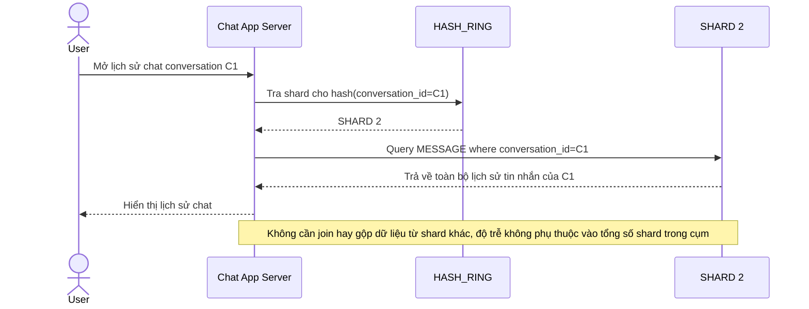

# Enhance sequence — Load history (query đúng 1 shard, không scatter-gather)

Đây là **enhance**, cùng flow "load-history" đã có ở base nhưng nay thay đổi: vì toàn bộ tin nhắn của 1 conversation nằm trên đúng 1 shard, app chỉ cần tra hash ring 1 lần rồi query duy nhất shard đó, không còn scatter-gather. Đáp ứng tiếp yêu cầu 1 của đề bài (giữ tính cục bộ để đọc lịch sử nhanh).

