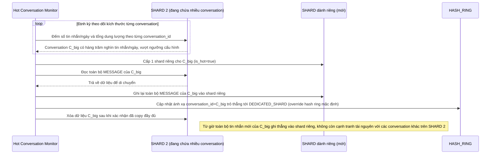

# Enhance sequence — Hot conversation isolation

Đây là **enhance**, flow hoàn toàn mới, phát sinh từ enhance — chưa tồn tại ở base vì base không có khái niệm hot conversation. Đáp ứng yêu cầu 2 của đề bài: phát hiện group chat cực lớn vượt ngưỡng và tách nó ra shard riêng để không làm quá tải shard đang chứa các conversation khác.

