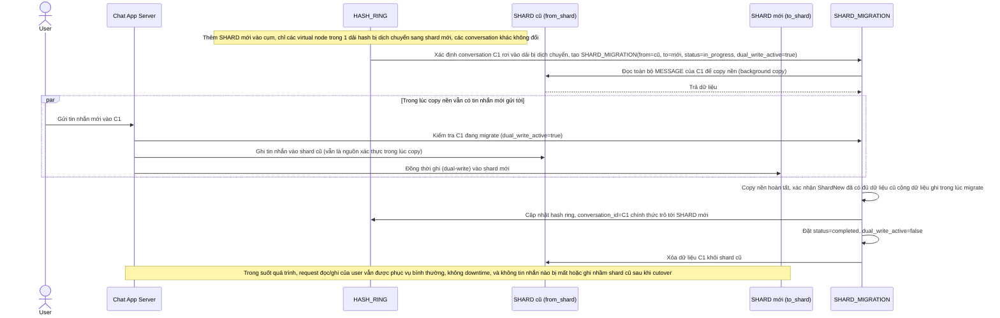

# Enhance sequence — Add shard, migrate conversation an toàn

Đây là **enhance**, flow hoàn toàn mới, phát sinh từ enhance — chưa tồn tại ở base vì base không có consistent hashing nên không có khái niệm "chỉ di chuyển phần bị dịch chuyển". Đáp ứng yêu cầu 3 (thêm shard chỉ ảnh hưởng conversation thuộc range bị dịch chuyển, không downtime) và yêu cầu 4 (tin nhắn gửi trong lúc migrate không bị mất hoặc ghi nhầm shard cũ) của đề bài.

