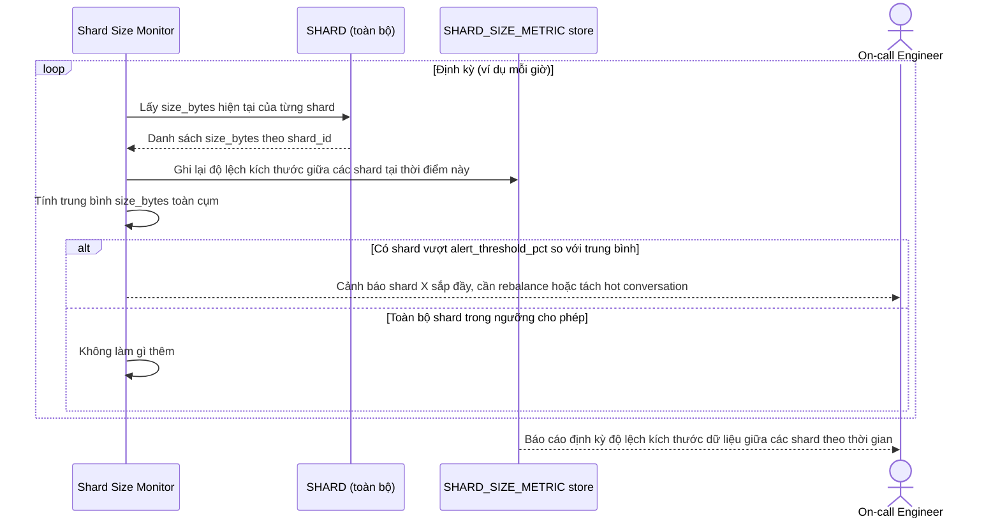

# Enhance sequence — Shard size monitoring & alert

Đây là **enhance**, flow hoàn toàn mới, phát sinh từ enhance — chưa tồn tại ở base. Đáp ứng yêu cầu 5 của đề bài: đo độ lệch kích thước dữ liệu giữa các shard theo thời gian và cảnh báo khi 1 shard vượt X% dung lượng trung bình để chủ động rebalance trước khi đầy.

