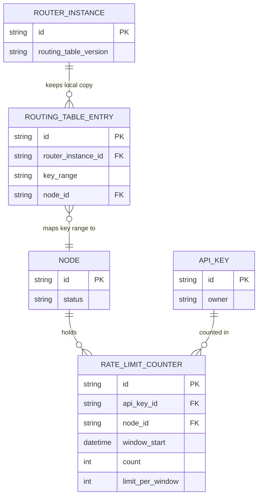

# Base ERD — Rate limiter cluster trước khi có consistent hashing đồng bộ

Đây là **base**: mô hình dữ liệu suy luận từ ngữ cảnh đề bài, thể hiện trạng thái **trước khi** cụm dùng chung 1 hash ring nhất quán. Base đã có cụm nhiều node đếm rate limit và nhiều router instance đứng trước cụm để định tuyến request, nhưng mỗi router instance giữ 1 bản `ROUTING_TABLE` cục bộ riêng (có thể không đồng bộ với nhau, đúng như rủi ro đề bài nêu ở yêu cầu 1) thay vì tra chung 1 hash ring duy nhất. Việc route dùng hashing đơn giản kiểu modulo N node, nên khi cụm scale sẽ làm hầu hết key bị remap. Chưa có khái niệm migrate counter, chưa có xử lý hot key.

