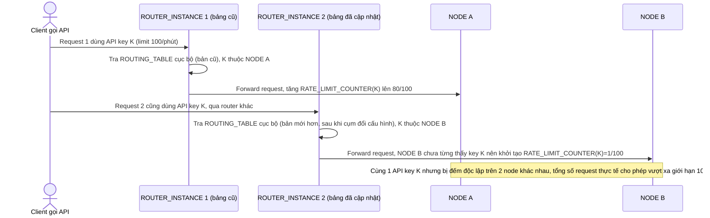

# Base sequence — Check rate limit (routing table không đồng bộ giữa router)

Đây là **base**, flow kiểm tra rate limit cho 1 request. Vì mỗi router instance giữ bản `ROUTING_TABLE` cục bộ riêng và có thể lệch nhau (chưa kịp đồng bộ sau lần cập nhật gần nhất), 2 request của cùng 1 API key qua 2 router khác nhau có thể bị route tới 2 node khác nhau. Đây chính là vấn đề yêu cầu 1 của đề bài mô tả.

