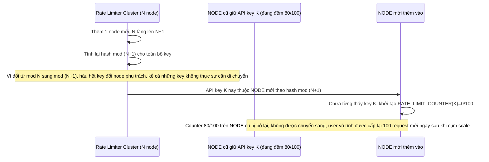

# Base sequence — Scale cluster (modulo hashing, counter bị reset)

Đây là **base**, flow khi cụm rate limiter thêm 1 node do scale tải. Vì dùng hashing kiểu modulo N (N thay đổi khi thêm node), gần như toàn bộ key bị ánh xạ lại sang node khác, và counter hiện tại không được chuyển theo — node mới coi mọi key là mới, đếm lại từ 0. Đây là vấn đề nền cho yêu cầu 2 của đề bài.

