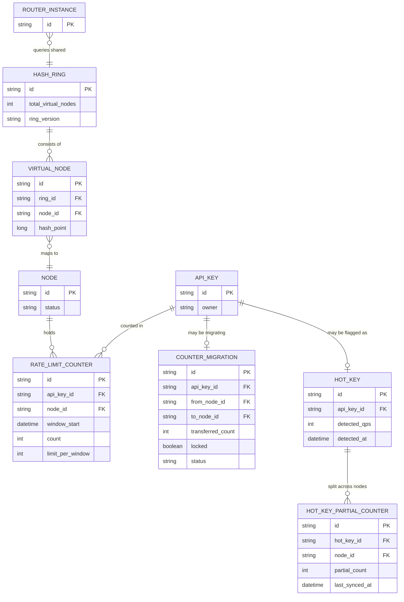

# Enhance ERD — Rate limiter cluster với consistent hashing dùng chung

Đây là **enhance**: mô hình dữ liệu sau khi mọi router instance tra chung 1 `HASH_RING` duy nhất thay vì giữ bảng cục bộ riêng. So với base, các entity mới: `HASH_RING`/`VIRTUAL_NODE` là nguồn sự thật duy nhất cho việc route key sang node (thay `ROUTING_TABLE_ENTRY` cục bộ, giải quyết yêu cầu 1); `COUNTER_MIGRATION` theo dõi việc chuyển giá trị counter hiện tại từ node cũ sang node mới khi rebalance, có cờ `locked` để chặn race condition khi cả node cũ và mới cùng nhận request cho key đang di chuyển (yêu cầu 2, 3); `HOT_KEY` và `HOT_KEY_PARTIAL_COUNTER` cho phép chia nhỏ việc đếm 1 key traffic cực lớn ra nhiều node rồi tổng hợp định kỳ (yêu cầu 4).

