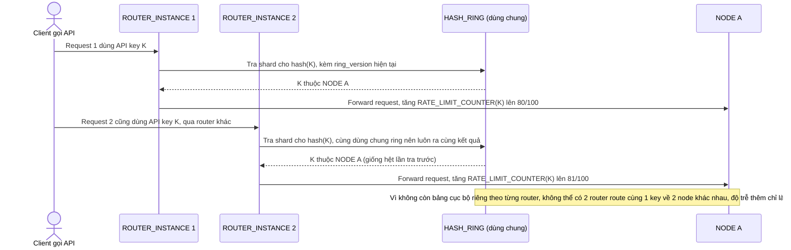

# Enhance sequence — Check rate limit (tra chung 1 hash ring duy nhất)

Đây là **enhance**, cùng flow "check-rate-limit" đã có ở base nhưng nay thay đổi: mọi router instance tra chung `HASH_RING` (nguồn sự thật duy nhất, có version rõ ràng) thay vì bảng cục bộ riêng, nên luôn route 1 API key về đúng 1 node. Đáp ứng yêu cầu 1 của đề bài.

