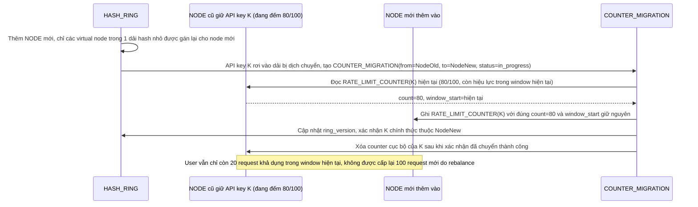

# Enhance sequence — Scale cluster (chuyển counter đúng giá trị, không reset)

Đây là **enhance**, cùng flow "scale-cluster" đã có ở base nhưng nay thay đổi: nhờ consistent hashing với virtual node, chỉ 1 phần nhỏ key bị dịch chuyển khi thêm node, và giá trị counter hiện tại của các key đó được chuyển nguyên vẹn sang node mới thay vì reset về 0. Đáp ứng yêu cầu 2 của đề bài.

