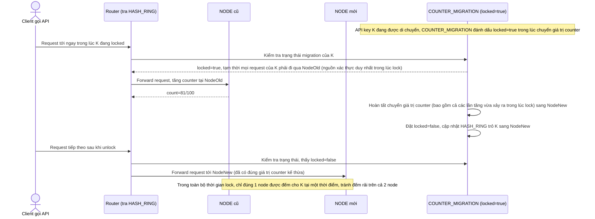

# Enhance sequence — Concurrent migration race (khóa key đang di chuyển)

Đây là **enhance**, flow hoàn toàn mới, phát sinh từ enhance — chưa tồn tại ở base vì base không xử lý race condition lúc rebalance. Đáp ứng yêu cầu 3 của đề bài: nhiều request của cùng 1 key tới gần như đồng thời ngay lúc key đó đang được di chuyển, tránh việc cả node cũ và mới cùng đếm độc lập.

