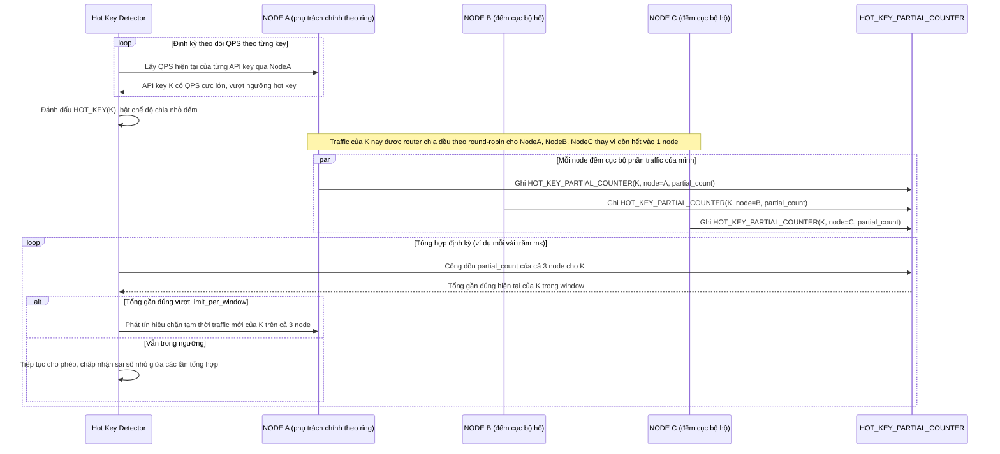

# Enhance sequence — Hot key handling (chia nhỏ đếm cục bộ, tổng hợp định kỳ)

Đây là **enhance**, flow hoàn toàn mới, phát sinh từ enhance — chưa tồn tại ở base vì base route toàn bộ traffic của 1 key vào đúng 1 node theo consistent hashing thuần, không xử lý hot key. Đáp ứng yêu cầu 4 của đề bài: phát hiện hot key và chia nhỏ việc đếm ra nhiều node để tránh nghẽn cổ chai, đánh đổi độ chính xác tức thời lấy khả năng chịu tải.

