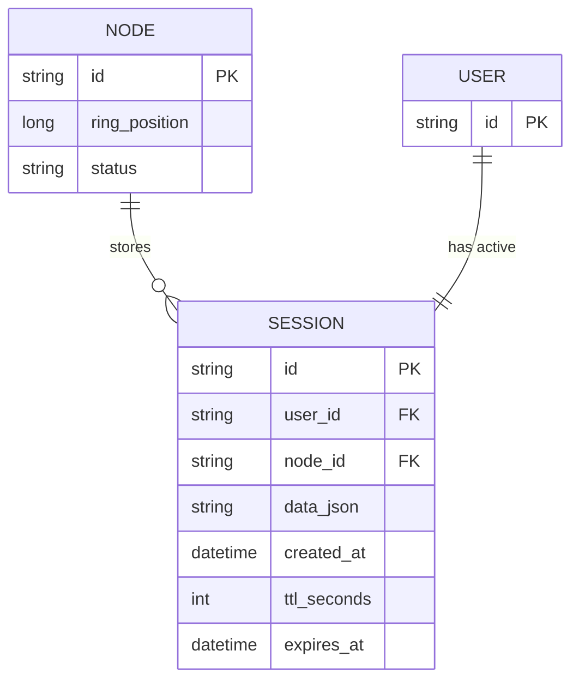

# Base ERD — Session store trước khi có virtual node và replication

Đây là **base**: mô hình dữ liệu suy luận từ ngữ cảnh đề bài, thể hiện trạng thái **trước khi** áp dụng virtual node và replicate session sang nhiều node. Base đã có cụm nhiều node lưu session (đúng như đề bài mô tả) và dùng consistent hashing thuần để quyết định session thuộc node nào, nhưng mỗi node vật lý chỉ có đúng 1 điểm trên ring (không có virtual node) nên tải dễ lệch, và mỗi session chỉ lưu trên đúng 1 node duy nhất (không có bản sao) nên node chết là mất trắng session của dải đó. Chưa có cơ chế double-read lúc rebalance, chưa có bảng "đang di chuyển".

