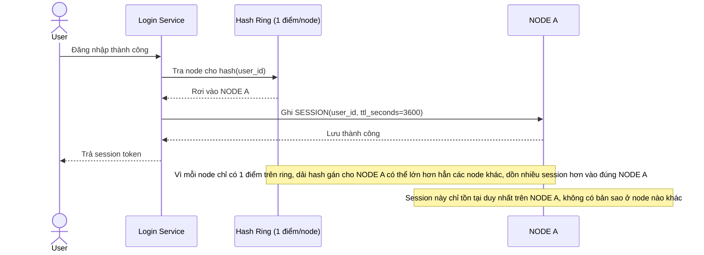

# Base sequence — Create session and route (1 điểm ring mỗi node, không replicate)

Đây là **base**, flow tạo session và xác định node lưu trữ. Ring chỉ có đúng 1 điểm hash cho mỗi node vật lý (không có virtual node), nên phân bổ tải có thể lệch giữa các node, và session chỉ được ghi trên đúng 1 node duy nhất — không có bản sao nào khác. Đây là nền cho yêu cầu 1 (cần virtual node để tránh lệch tải) và yêu cầu 3 (cần replication để chịu được mất node) của đề bài.

