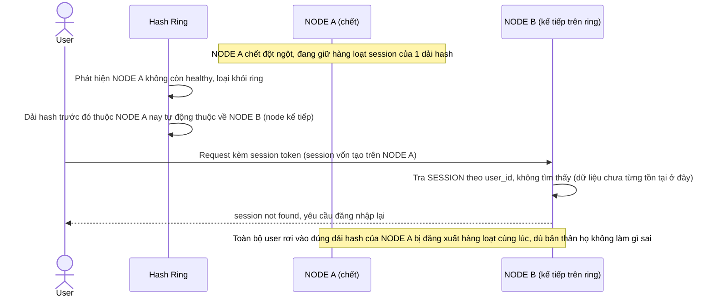

# Base sequence — Node failure (mất session hàng loạt)

Đây là **base**, flow khi 1 node lưu session chết đột ngột. Vì consistent hashing thuần không có replication, toàn bộ session trên node chết dồn hết sang node kế tiếp trên ring theo định nghĩa thuật toán — nhưng dữ liệu thực tế của các session đó đã mất, không tự nhiên "có sẵn" ở node kế tiếp. Đây là vấn đề nền cho yêu cầu 3 của đề bài.

