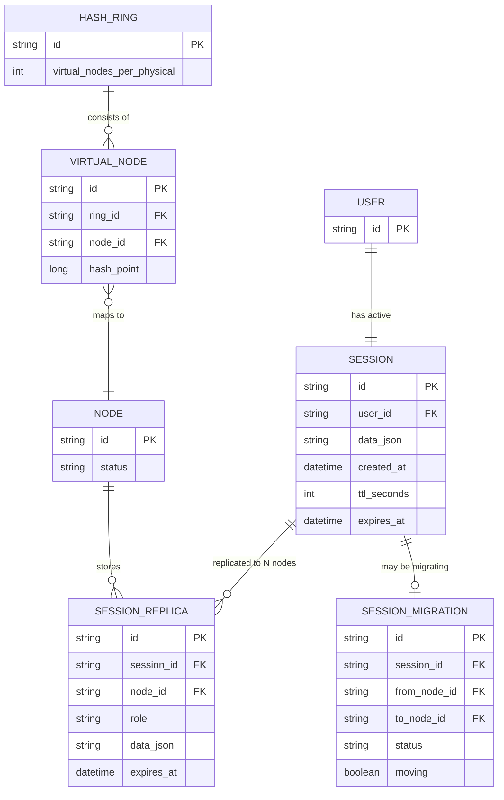

# Enhance ERD — Session store với virtual node và replication

Đây là **enhance**: mô hình dữ liệu sau khi thêm virtual node và replication. So với base, các thay đổi/entity mới: `HASH_RING`/`VIRTUAL_NODE` cho phép mỗi node vật lý có nhiều điểm ảo trên ring để tải phân bổ đều hơn (yêu cầu 1); `SESSION` không còn gắn cứng vào 1 `node_id` mà có `SESSION_REPLICA` trên N node kế cận trên ring, mỗi bản sao giữ đúng `expires_at` gốc, không bị reset TTL khi di chuyển (yêu cầu 3, 4); `SESSION_MIGRATION` là bảng "đang di chuyển" để router biết session nào đang trong giai đoạn chuyển tiếp và nên hỏi node nào, tránh session-not-found tạm thời trong lúc rebalance (yêu cầu 2).

