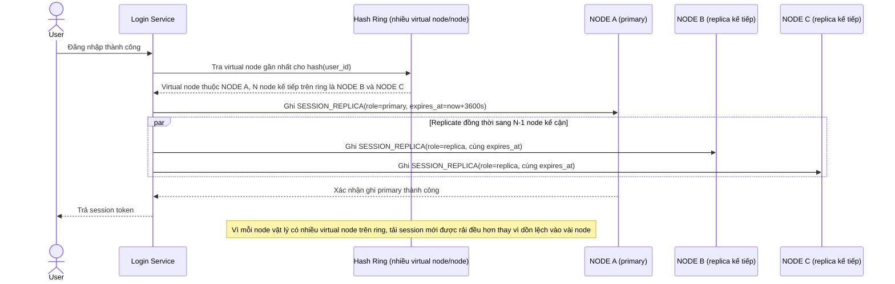

# Enhance sequence — Create session and route (virtual node + replicate N node)

Đây là **enhance**, cùng flow "create-session-and-route" đã có ở base nhưng nay thay đổi: ring có nhiều virtual node cho mỗi node vật lý nên tải phân bổ đều hơn, và session được ghi thành `SESSION_REPLICA` trên N node kế cận trên ring thay vì chỉ 1 node duy nhất. Đáp ứng yêu cầu 1 (virtual node) và đặt nền cho yêu cầu 3 (replication) của đề bài.

