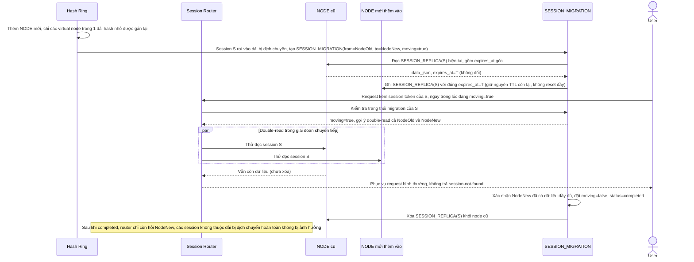

# Enhance sequence — Scale cluster rebalance (bảng "đang di chuyển", giữ nguyên TTL)

Đây là **enhance**, flow hoàn toàn mới, phát sinh từ enhance — chưa tồn tại ở base vì base không có cơ chế rebalance an toàn khi thêm/bớt node. Đáp ứng yêu cầu 1 (chỉ session thuộc dải hash bị dịch chuyển mới di chuyển), yêu cầu 2 (router biết hỏi node nào trong lúc chuyển tiếp, tránh session-not-found tạm thời) và yêu cầu 4 (giữ nguyên TTL gốc khi di chuyển) của đề bài.

