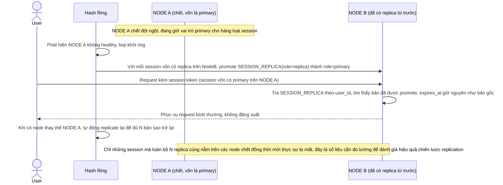

# Enhance sequence — Node failure (replica đã có sẵn, không mất session)

Đây là **enhance**, cùng flow "node-failure-session-loss" đã có ở base nhưng nay thay đổi hoàn toàn: vì mỗi session đã được replicate sang N node kế cận từ trước (xem flow "create-session-and-route"), node chết không còn gây mất session — 1 trong các replica còn sống được promote lên làm primary ngay. Đáp ứng yêu cầu 3 của đề bài.

