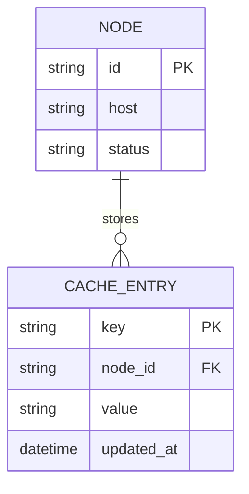

# Base ERD — Cache cluster trước khi có consistent hashing

Đây là **base**: mô hình dữ liệu suy luận từ ngữ cảnh đề bài, thể hiện trạng thái **trước khi** cụm cache dùng consistent hashing với virtual node. Base đã có N node cache dùng chung cho nhiều service (đúng như đề bài mô tả), nhưng key được ánh xạ sang node bằng hashing kiểu modulo N node — không có ring, không có virtual node. Chưa có khái niệm migration job hay dual-write, nên thêm/bớt node sẽ làm hầu hết key đổi node.

