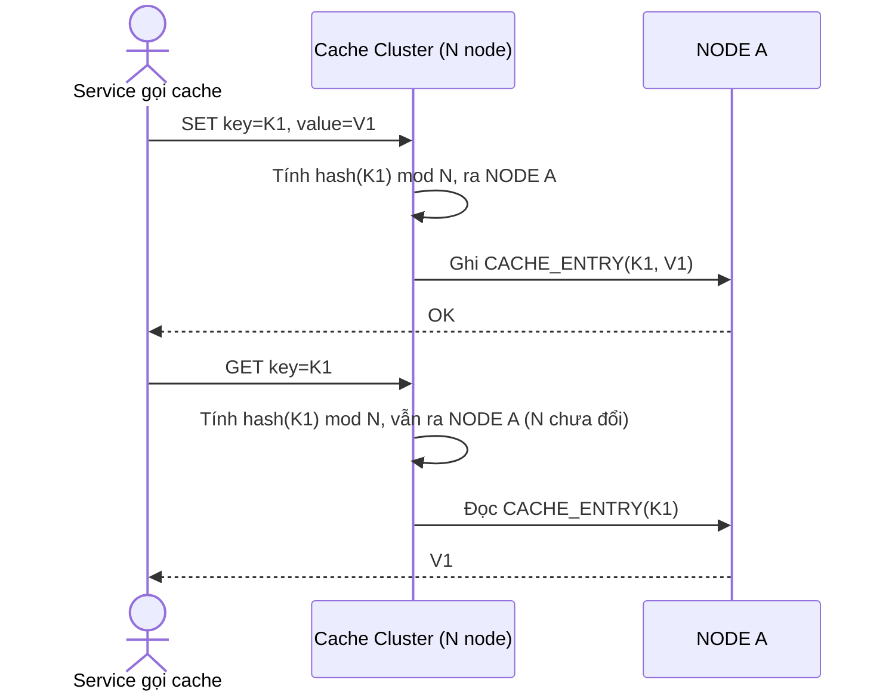

# Base sequence — Get/set key (hash modulo N node)

Đây là **base**, flow đọc/ghi 1 key vào cache cluster ở trạng thái hiện tại — node phụ trách được xác định bằng `hash(key) mod N`. Cách này hoạt động bình thường khi cụm ổn định, nhưng là nguyên nhân trực tiếp gây ra vấn đề khi N thay đổi (xem flow "add-node"), làm nền cho toàn bộ đề bài về resharding.

