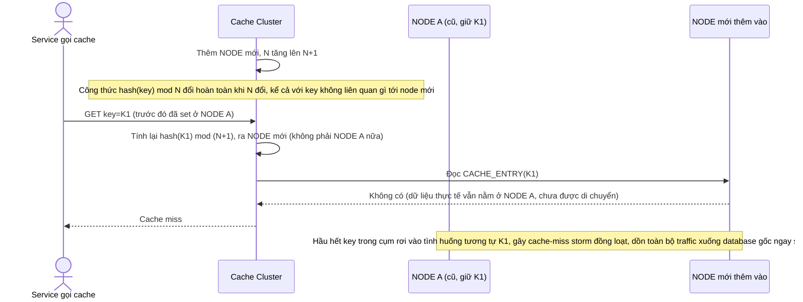

# Base sequence — Add node (rehash toàn bộ, cache-miss storm)

Đây là **base**, flow thêm 1 node vào cụm cache đang dùng hashing modulo N. Vì N đổi thành N+1, công thức `hash(key) mod N` cho ra kết quả khác cho gần như mọi key, dù key đó không thực sự cần đổi node — toàn bộ dữ liệu coi như phải rehash lại, gây cache-miss hàng loạt. Đây chính là vấn đề mà yêu cầu 1 và 2 của đề bài muốn giải quyết bằng consistent hashing.

