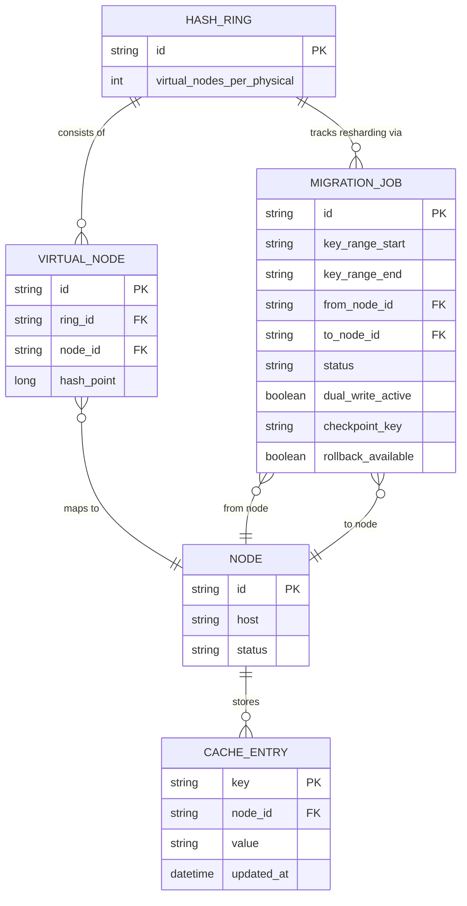

# Enhance ERD — Cache cluster với consistent hashing và migration job

Đây là **enhance**: mô hình dữ liệu sau khi cụm dùng consistent hashing với virtual node. So với base, các entity mới: `HASH_RING`/`VIRTUAL_NODE` — mỗi node vật lý có nhiều điểm ảo trên ring để tránh hot node khi số node vật lý ít (yêu cầu 2), thay cho hashing modulo N cứng; `MIGRATION_JOB` theo dõi tiến trình resharding cho 1 dải key cụ thể, có `dual_write_active` để xử lý đọc/ghi đúng trong lúc key đang di chuyển (yêu cầu 3), và `checkpoint_key`/`rollback_available` để có thể rollback giữa chừng mà không mất phần đã migrate xong (yêu cầu 4).

