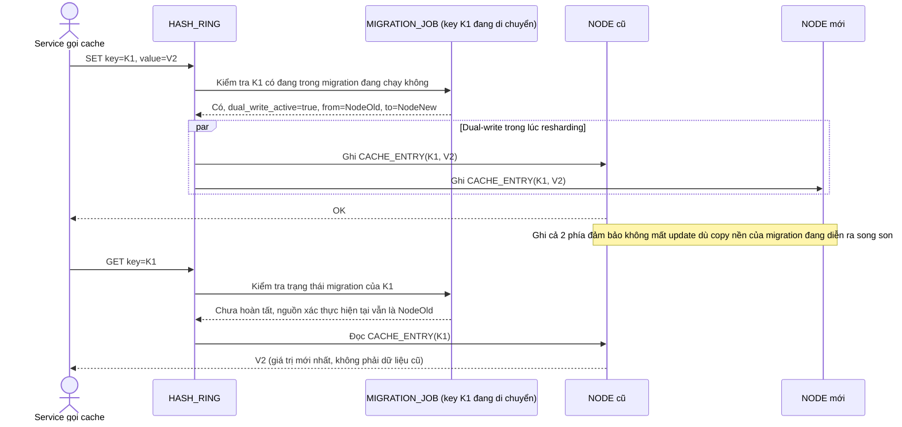

# Enhance sequence — Get/set key (đúng trong lúc resharding, dual-write)

Đây là **enhance**, cùng flow "get-set-key" đã có ở base nhưng nay thay đổi: node phụ trách được tra qua `HASH_RING`, và khi key đang nằm trong `MIGRATION_JOB` đang chạy, hệ thống dual-write (ghi cả node cũ lẫn node mới) và route đọc theo đúng nguồn còn xác thực, để không mất update và không đọc dữ liệu cũ. Đáp ứng yêu cầu 3 của đề bài.

