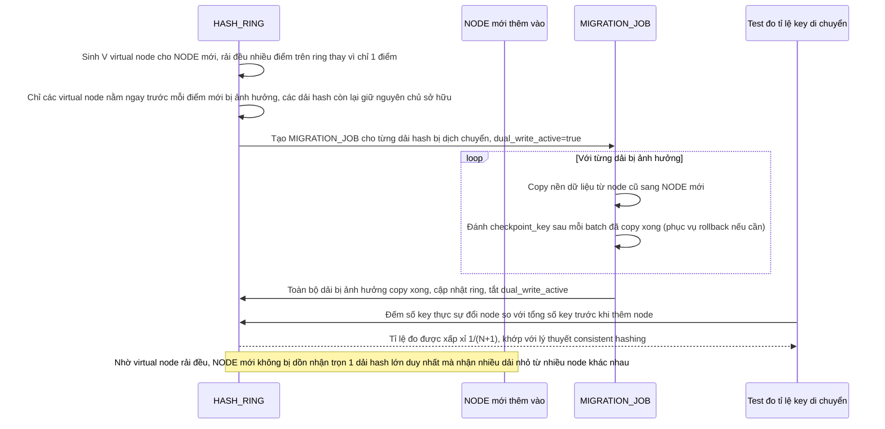

# Enhance sequence — Add node (chỉ ~1/(N+1) key di chuyển, virtual node tránh hot node)

Đây là **enhance**, cùng flow "add-node" đã có ở base nhưng nay thay đổi hoàn toàn: nhờ consistent hashing với virtual node, thêm 1 node vào cụm N node chỉ khiến khoảng 1/(N+1) tổng số key phải di chuyển, và tải được rải đều nhờ nhiều virtual node cho mỗi node vật lý thay vì dồn vào 1 điểm duy nhất. Đáp ứng yêu cầu 1 và 2 của đề bài.

