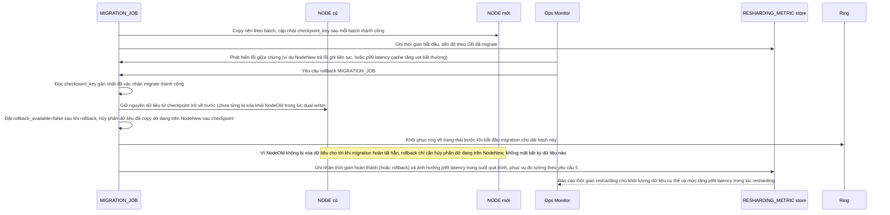

# Enhance sequence — Resharding rollback (không mất phần đã migrate)

Đây là **enhance**, flow hoàn toàn mới, phát sinh từ enhance — chưa tồn tại ở base vì base rehash toàn bộ ngay lập tức, không có khái niệm migration job để rollback. Đáp ứng yêu cầu 4 của đề bài: phát hiện lỗi giữa quá trình migrate và rollback được mà không mất dữ liệu đã migrate một phần.

