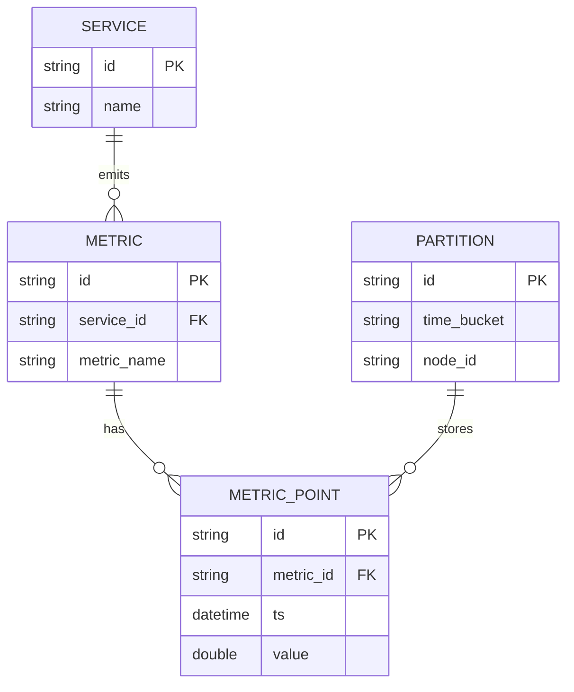

# Base ERD — Hệ thống metrics chỉ partition theo thời gian

Đây là **base**: trạng thái hệ thống giám sát *trước khi* áp dụng chiến lược partition kết hợp. Suy luận từ ngữ cảnh đề bài (hệ thống nhận metrics từ hàng chục nghìn service, cần lưu time-series), base đã có `SERVICE`/`METRIC`/`METRIC_POINT` cơ bản và một cơ chế partition đơn giản — chỉ chia theo `time_bucket` (ví dụ mỗi giờ 1 partition), gán round-robin cho các node, chưa hề phân biệt theo nguồn service. Đây chính là tiền đề khiến các vấn đề "hot partition", "scan cả cụm khi query theo service" nêu trong đề bài xảy ra.

