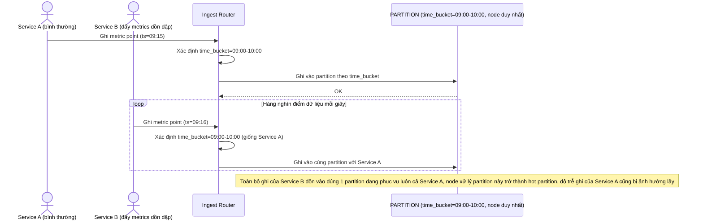

# Base sequence — Ingest metric (chỉ partition theo thời gian)

Đây là **base**, flow ghi 1 điểm dữ liệu metric ở trạng thái hiện tại — router chỉ xác định `time_bucket` hiện tại rồi ghi vào đúng 1 partition dùng chung cho *mọi* service. Flow này là tiền đề trực tiếp cho yêu cầu 1 và 4 của đề bài, vì đây là nơi phát sinh rủi ro "hot partition" khi một service đẩy metrics dồn dập.

