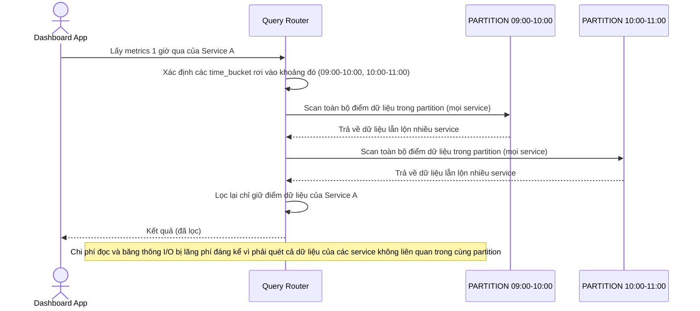

# Base sequence — Query metrics theo khoảng thời gian (phải scan lẫn dữ liệu service khác)

Đây là **base**, flow truy vấn metrics trong 1 khoảng thời gian của 1 service cụ thể. Vì partition base chỉ chia theo thời gian, dữ liệu của mọi service bị trộn lẫn trong cùng partition, nên dù đã xác định đúng các time bucket liên quan, hệ thống vẫn phải scan toàn bộ dữ liệu trong đó rồi lọc theo `service_id`. Flow này là tiền đề cho yêu cầu 2 của đề bài (truy vấn phải chỉ chạm partition tối thiểu và không cần scan dư thừa).

