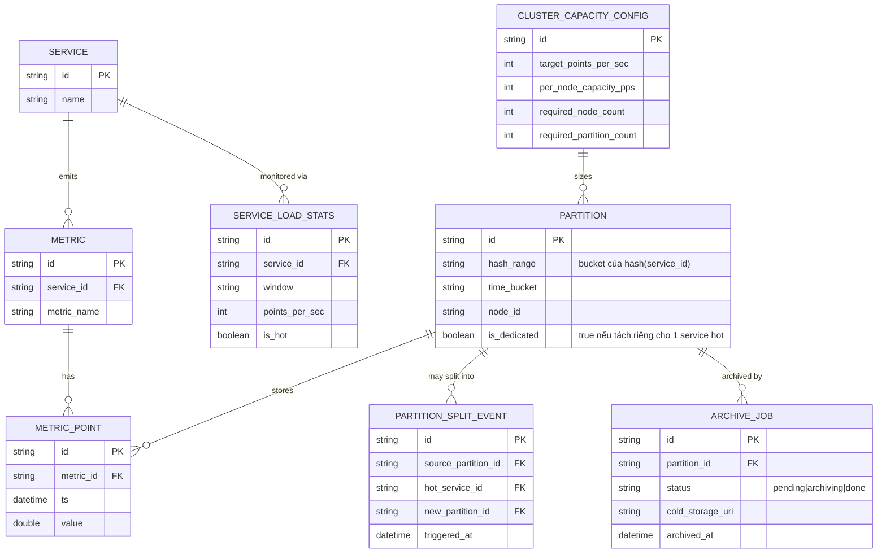

# Enhance ERD — Partition kết hợp hash(service) + time bucket, kèm archive và hot-partition splitting

Đây là ERD **sau khi** enhance được áp dụng lên base. So với base, `PARTITION` được đổi khóa phân mảnh sang composite (`hash_range` + `time_bucket`) thay vì chỉ theo thời gian, và có thêm 4 entity mới, ứng trực tiếp với các yêu cầu trong đề bài:

- `PARTITION` thêm `hash_range` (bucket của `hash(service_id)`) và `is_dedicated` — đáp ứng yêu cầu 1 (composite key hash(service)+time bucket, tránh hot partition).
- `CLUSTER_CAPACITY_CONFIG` (mới) — lưu số node/partition cần thiết để đạt throughput mục tiêu, đáp ứng yêu cầu 4.
- `ARCHIVE_JOB` (mới) — theo dõi việc nén/di chuyển partition cũ sang cold storage mà không chặn ghi mới, đáp ứng yêu cầu 3.
- `SERVICE_LOAD_STATS` và `PARTITION_SPLIT_EVENT` (mới) — phát hiện service gây lệch tải và ghi nhận sự kiện tách partition riêng cho service đó, đáp ứng yêu cầu 5.

