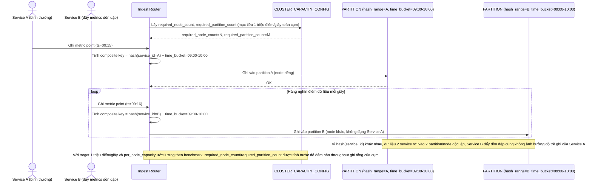

# Enhance sequence — Ingest metric (composite key hash(service) + time bucket)

Đây là **enhance** của flow `ingest-metric` đã có ở base. So với base, router không còn chỉ dựa vào `time_bucket` mà tính thêm `hash(service_id)` để chọn đúng partition trong composite key, nên các service khác nhau trong cùng khung giờ được rải đều ra nhiều partition/node khác nhau. Đáp ứng yêu cầu 1 (tránh hot partition bằng composite key) và yêu cầu 4 (số node/partition được tính theo throughput mục tiêu).

