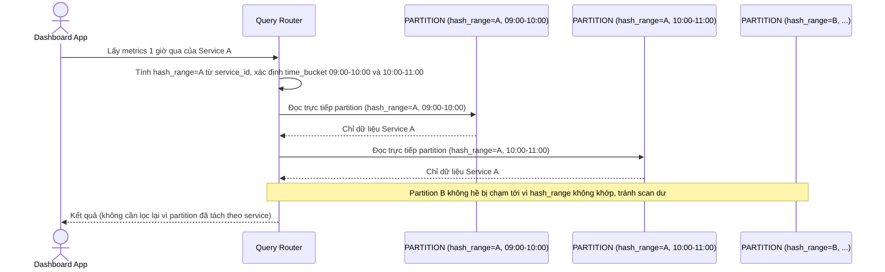

# Enhance sequence — Query metrics theo khoảng thời gian (chỉ chạm partition tối thiểu)

Đây là **enhance** của flow `query-metrics-range` đã có ở base. So với base (phải scan toàn bộ dữ liệu trong mỗi time bucket rồi lọc), nay router tính được `hash(service_id)` để xác định chính xác `hash_range`, kết hợp với các `time_bucket` liên quan, nên chỉ cần chạm đúng các partition chứa dữ liệu của service đó, không đọc dư dữ liệu service khác. Đáp ứng yêu cầu 2 của đề bài.

