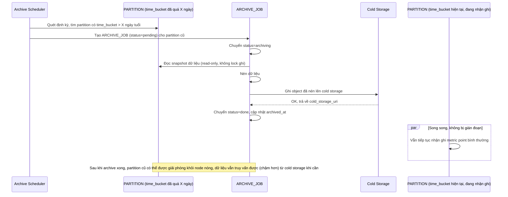

# Enhance sequence — Archive partition cũ sang cold storage

Đây là **enhance**, flow hoàn toàn mới, chưa tồn tại ở base (base không có cơ chế archive). Đáp ứng yêu cầu 3 của đề bài: partition cũ hơn X ngày được tự động nén/di chuyển sang storage rẻ hơn mà không làm gián đoạn ghi dữ liệu mới của các partition khác (kể cả partition đang active).

