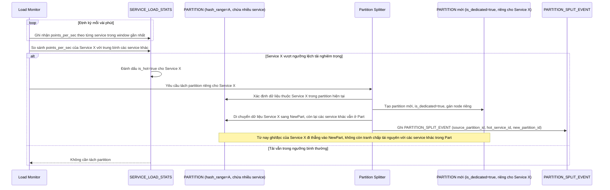

# Enhance sequence — Phát hiện hot partition và tách partition riêng

Đây là **enhance**, flow hoàn toàn mới, chưa tồn tại ở base. Đáp ứng yêu cầu 5 của đề bài: phát hiện 1 service có tải lớn bất thường so với các service khác trong cùng `hash_range`, rồi tách riêng 1 partition dành cho service đó (partition splitting theo nhu cầu).

